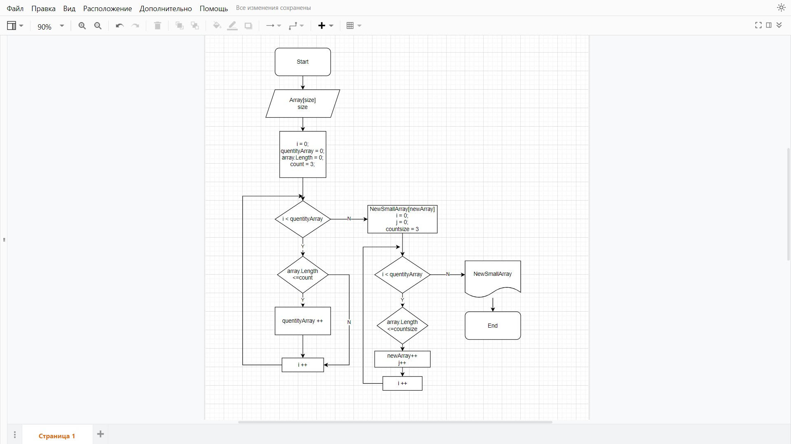

# Итоговая работа
## Задача:
Написать программу, которая из имеющегося массива строк формирует массив из строк, длина которых меньше, либо равна 3 символам. 

Первоначальный массив можно ввести с клавиатуры, либо задать на старте выполнения алгоритма. 
## Блок-схема решения задачи:
 
## Решение задачи: 
Задача решается с помощью методов, описанных ниже, массив запрашивается у пользователя.
1.	*CreateArray*  -  создает текстовый массив, данные и размер запрашивает у пользователя. Если пользователь вводит пустую строку, появляется дополнительный запрос.
2.	*CountElements* - считает количество символов в массиве, который заполнил пользователь.
3.	*NewSmallArray*  - формирует массив из строк, введенных пользователем (п.1), длина которых меньше, либо равна 3 символам 
4.	*ShowArray*  - печатает массив из строк, длина которых меньше, либо равна 3 символам
